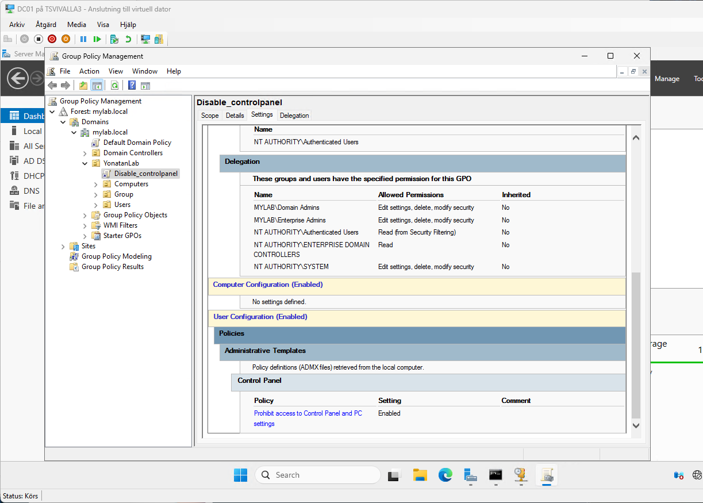

# 🧱 Active Directory Lab – mylab.local

> This hands-on lab demonstrates the deployment and management of a complete **Windows Server Active Directory environment** in a virtualized **Hyper-V** setup.  
> It includes a Domain Controller (AD DS, DNS, DHCP), a Windows 10 domain client, and applied Group Policy configurations to simulate real-world enterprise administration tasks.

---

### 📘 Overview
This project documents the setup of a **Windows Server Active Directory environment** built on **Hyper-V**.  
It simulates a small enterprise network with a Domain Controller, DNS, DHCP, and Group Policy (GPO) configuration, fully tested with a Windows 10 client.

---

## 🖥️ Virtual Environment
| VM | Role | Hostname | OS |
|----|------|-----------|----|
| DC01 | Domain Controller + DNS + DHCP | DC01.mylab.local | Windows Server 2022 |
| WIN10 | Domain Client | WIN10.mylab.local | Windows 10 Pro |
| LINUX | Optional Node | Ubuntu 22.04 | — |

**Network:** Default Switch (NAT)  
**Domain:** `mylab.local`

---

## ⚙️ Domain Controller Configuration

### IP & DNS

- **IP:** 172.29.208.48  
- **Subnet:** 255.255.240.0  
- **Gateway:** 172.29.208.1  
- **DNS:** 127.0.0.1 (local loopback)

---

## 🧩 Active Directory Structure

### OU Layout

Organizational Unit: **YonatanLab**

**Sub-OUs:**
- `Computers` → WIN10  
- `Users` → Yonatan Abraha (Domain Admin), Henok Tzadu  
- `Groups` → (for future GPO testing)

---

## 🌐 DNS & DHCP Configuration

### Forward & Reverse Lookup Zones

### DHCP Scope

- **Range:** 172.29.208.50 – 172.29.208.100  
- **Gateway:** 172.29.208.1  
- **DNS:** 172.29.208.48  
- **Domain:** mylab.local  
- Dynamic DNS updates enabled (secure only)

---

## 🔐 Group Policy – Disable Control Panel

**Policy Name:** Disable_ControlPanel  
**Linked to:** OU → YonatanLab  
**Effect:** Domain user (Henok) cannot access Control Panel  
**Status:** ✅ Verified via Win10 login test

---

## 🧠 Skills Demonstrated
- Installation & configuration of AD DS  
- DNS and DHCP setup with secure updates  
- OU and user management  
- Group Policy creation and linking  
- Name resolution and network testing  
- Documentation of IT lab projects (GitHub portfolio)

---

## 🚀 Next Steps
- Add File Server and NTFS permissions lab  
- Test GPOs for software deployment and logon scripts  
- Integrate Azure AD for hybrid identity demo

---

**Created by:** Yonatan Abraha  
**GitHub:** [yoab39](https://github.com/yoab39)  
**License:** MIT
